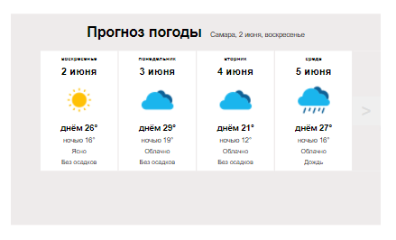
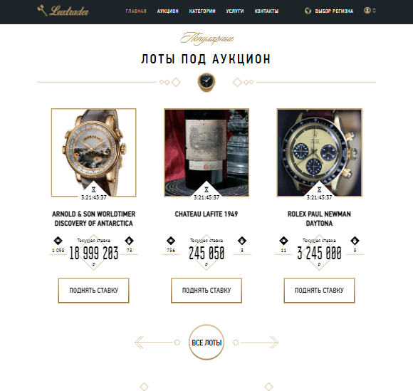

# Структура
Папка `2020` - первые тренировочный проект для знакомства с фронтендом и технического роста.

## 0) Weather: слайдер погоды
*храню как память - первое задание для прохода на курс

## 1) Marketika: Лендинг страница
Технологии: `HTML / SCSS / Gulp / БЭМ`

Тренировочный проект для технического роста (Без JavaScript)

### Функционал:
- Адаптивная и кроссбраузерная верстка (Chrome, Mozilla, Opera);
- Использование препроцессора SCSS/SASS;
- Использования методологии БЭМ;
- Использования таск-менеджера/сборщика Gulp; 
- Процесс разработки и версия для сборки находятся в ветке "development";

## 2) LuxTrade: Лендинг страница
Технологии: `HTML / SCSS / JavaScript / Gulp / БЭМ`

### Функционал
- Все компоненты написаны на чистом JavaScript;
- Адаптивная и кроссбраузерная верстка (Chrome, Mozilla, Opera);
- Динамическое отслеживание скролла в шапке сайта;
- Бургер меню для экранов меньше 768px; 
- 2 Вида слайдера Main & Lots;
- Свайпер Main для мобильных устройств;
- Простое применения CSS animations для Main slider;
- Использование препроцессора SCSS/SASS;
- Использования методологии БЭМ;
- Использования таск-менеджера/сборщика Gulp; 
- Процесс разработки и версия для сборки находятся в ветке "development";

